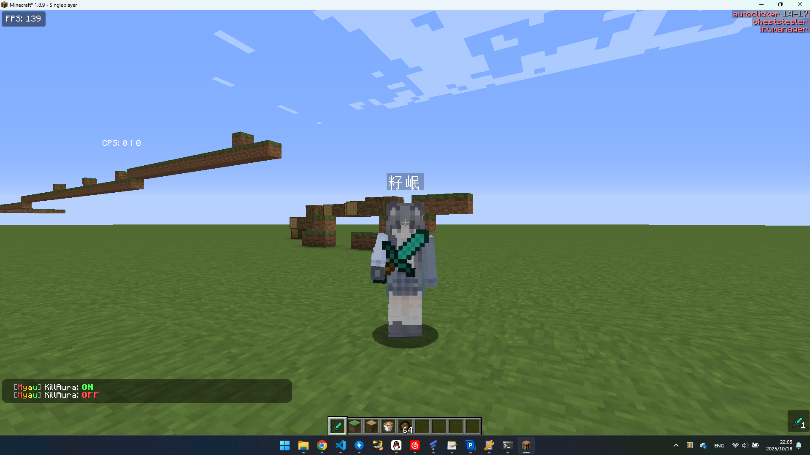

# Myau

# 介绍

这是一个魔改[OpenMyau](https://github.com/60124808866/OpenMyau)的项目。

# 添加了什么？

相对于原本Myau，添加了以下功能：

1. IDEA-like ClickGUI

# Build

1. Clone this repo
2. Run `./gradlew build`
3. Find the jar in `build/libs`

# 运行

1. 把Myau.jar放到Minecraft的mods文件夹中
2. 运行Minecraft
3. enjoy

